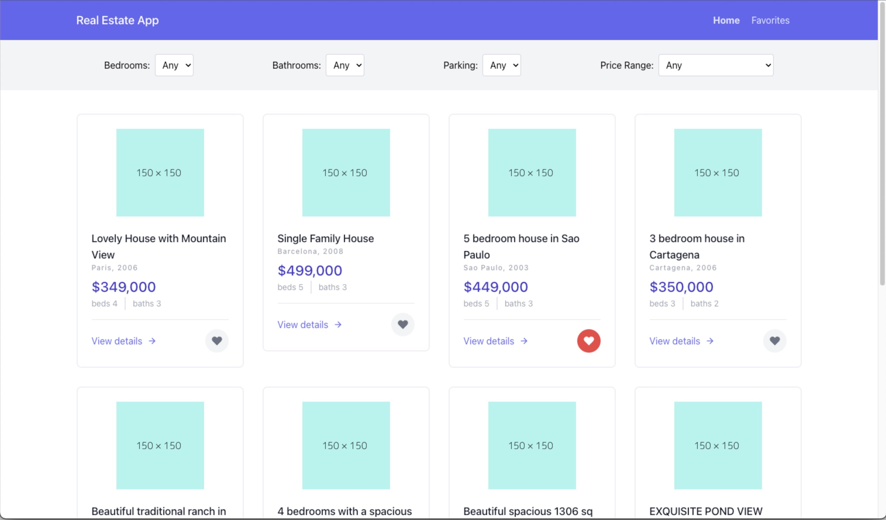
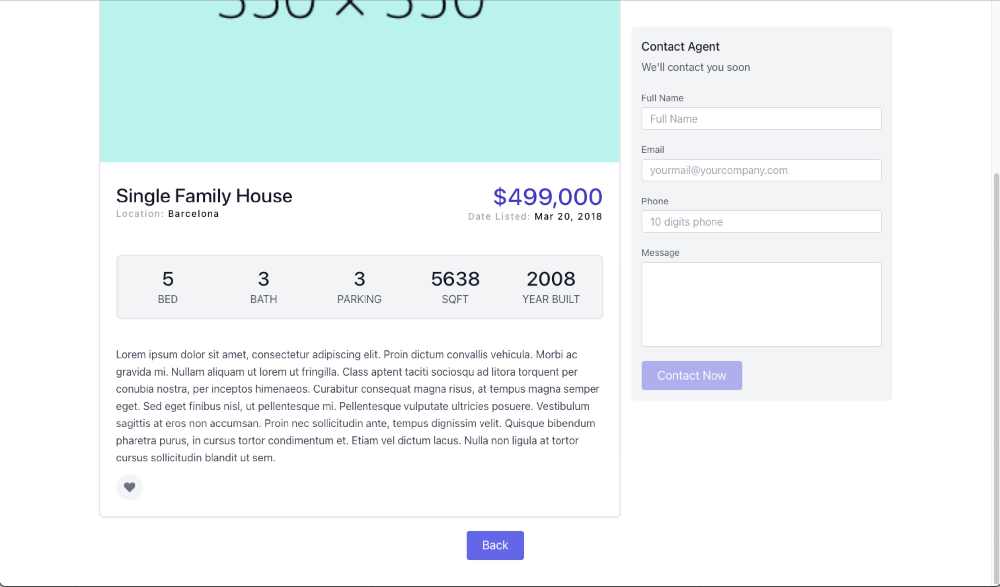
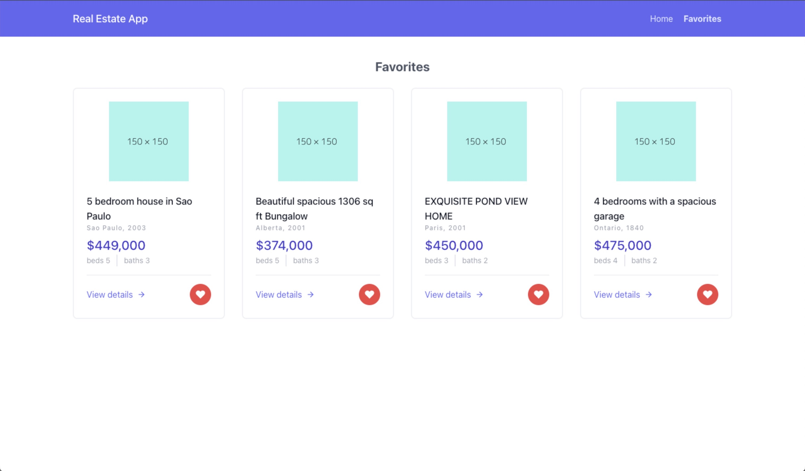

# n8-frontend-Challenge 

## Intro
Real Estate Listing web app

#### Main technologies:
- React JS
- Tailwind CSS
- React Context

#### How to start:
- Clone this repo
- Jump to the project folder
- cd n8-frontend-challenge && yarn install
- Run | yarn start

## The challenge

#### Task 1 - Create page with the following details:
• A filter section where the user can filter by number of Bedrooms, Bathrooms, Parking
spaces and Price Range. This section should be functional and filter the data according
to user input.
• A listings section that will display the following information:
o Listing thumbnail, Title, Location, # of Bedrooms, # of Bathrooms, Price
o A “View Details” button that will take the user to the following page.

#### Task 2 - Create an additional page or modal where the user can see the details of the selected listing. 

This will be displayed after the user clicks on the “View details” button from the previous task.
This new section should display the following information:

- Listing Title, Picture, # of bedrooms, # of bathrooms, # of parking spaces, square footage, year built,
price, location, description and date listed in the format “Feb 18, 2023”.
- A “Contact Agent” form with the following:
- Full Name, Email, Phone and Comments fields.
- A “Contact Now” button with the following behavior:
- Field validation: All fields should not be empty. Email field should have a valid email
format and phone should only allow numbers.
- When clicking the button, it will validate all fields and display a red message with the
validation error when there is an empty field or a format error.
- You can also add other ways of validation if you prefer.
- When clicking the button if all validations are ok it will display a green “Message sent
successfully” message.

#### Bonus 
Add a “Save Property” button that will display a modal with all other saved properties.

#### Demo video
https://github.com/massuiabigdog/n8-frontend-challenge/assets/16282589/70062409-e9dc-4ee8-b694-1f4f45efa306

#### Screens

  
  
  

### Let's work together! 

Hi! My name is Thiago Massuia, I'm a fullstack developer with a focus on React and NodeJS.
I'm passionate about JavaScript and I have a lot of experience working with it.
I also have fluency in English, Portuguese, and Spanish.
You can take a look at my website to know more about me:

- Online Presentation - https://tmassuia.com/
- Portfolio - https://projects.tmassuia.com/
- Linkedin - https://www.linkedin.com/in/tmassuia/
